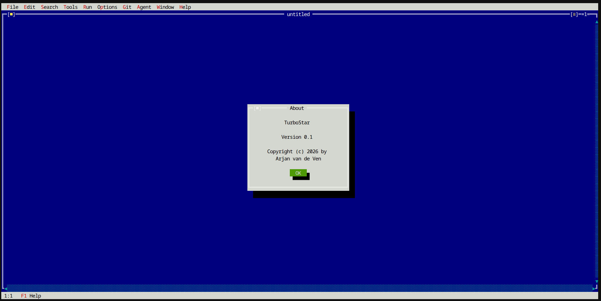

# Turbostar

Turbostar is a terminal-based (TUI) text editor designed with the classic look and feel of Turbo Pascal, but modernized with WordStar keybindings (specifically the "joe" dialect).

It is built for speed, responsiveness, and seamless integration with modern development workflows, featuring built-in Language Server Protocol (LSP) support, Git integration, and LLM agent capabilities.



## What is this?

Turbostar aims to provide a distraction-free, highly responsive editing experience in the terminal. It combines a nostalgic, tiled window interface with powerful features:

*   **Classic UI:** Turbo Pascal aesthetics with double-line borders, drop shadows, and a global menu bar.
*   **WordStar/Joe Keybindings:** Persistent marker selection (`^KB`, `^KK`), stateful prefix keys (`^K`), and standard navigation.
*   **LSP Integration:** Live diagnostics, hover information, and semantic highlighting via `clangd` (for C/C++).
*   **Built-in LLM Agent:** A dedicated Agent window (`^KA`) that can read your workspace, compile code, and suggest surgical edits using a secure, tool-based sandbox.
*   **High Performance:** O(1) UTF-8 character extraction, optimized drawing loops, and $O(N)$ linear time regex operations (via `re2`) to prevent UI stutter and ReDoS vulnerabilities.
*   **Git Integration:** Real-time branch and dirty status in window titles, and an integrated `Compile Output` / `Test Output` split view.

## How to build

Turbostar is written in C++23 and uses the Meson build system.

### Prerequisites

You will need the following installed on your system:
*   `g++` (or `clang++`) with C++23 support
*   `meson` and `ninja`
*   `pkg-config`
*   `libncursesw5-dev` (ncurses with wide-character support)
*   `libre2-dev` (Google's RE2 regular expression library)
*   `nlohmann-json3-dev`
*   `libcpp-httplib-dev`
*   `libsqlite3-dev`
*   `libdtl-dev` (Diff Template Library)
*   `libunwind-dev` (For stack unwinding)

On Debian/Ubuntu-based systems, you can install the required dependencies with:
```bash
sudo apt update
sudo apt install g++ meson ninja-build pkg-config libncursesw5-dev libre2-dev nlohmann-json3-dev libcpp-httplib-dev libsqlite3-dev libdtl-dev libunwind-dev
```

### Build Instructions

1.  Clone the repository and initialize submodules (for the LSP framework):
    ```bash
    git clone https://github.com/yourusername/turbostar.git
    cd turbostar
    git submodule update --init --recursive
    ```

2.  Setup the build directory:
    ```bash
    meson setup build
    ```

3.  Compile the project:
    ```bash
    meson compile -C build -j4
    ```

4.  Run the executable:
    ```bash
    ./build/turbostar
    ```

*(Optional)* Run the end-to-end test suite:
```bash
MESON_TESTTHREADS=2 meson test -C build
```

## Quirks and behaviors

*   **Mouse Paste in X11:** Turbostar hijacks the mouse cursor to support clicking menus and window borders. If you want to use your terminal emulator's native middle-click paste or highlight-to-copy, you must **hold the Shift key** while clicking or dragging.
*   **Windows Colors:** If you are running Turbostar on Windows (e.g., via WSL or SSH) and get "black on black" rendering issues, you need to change your terminal emulator. `xterm` often fails to render the Turbo Pascal palette correctly on Windows; using **Windows Terminal (`ms-terminal`)** resolves the issue.
*   **Sandboxed LLM Edits:** The LLM agent cannot edit the `Compile Output`, `Test Output`, or `Agent Chat` windows; they are strictly read-only.