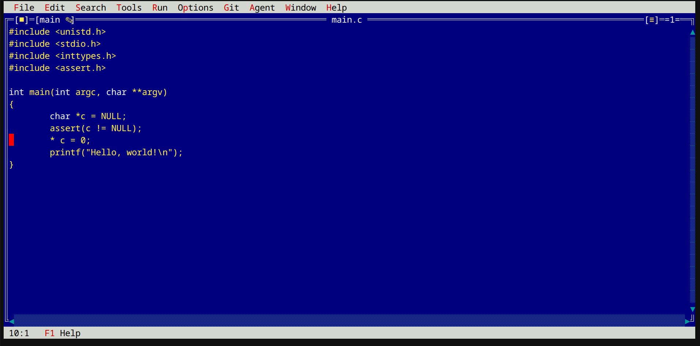
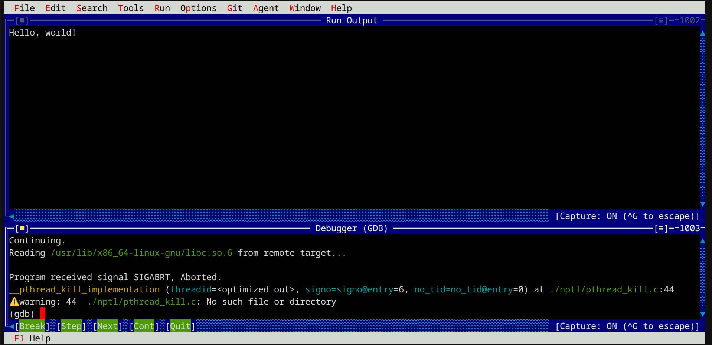
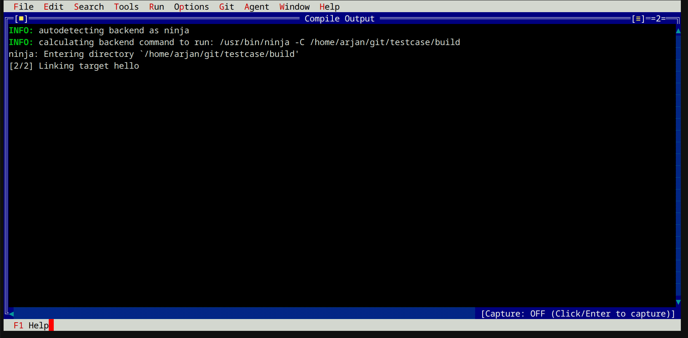
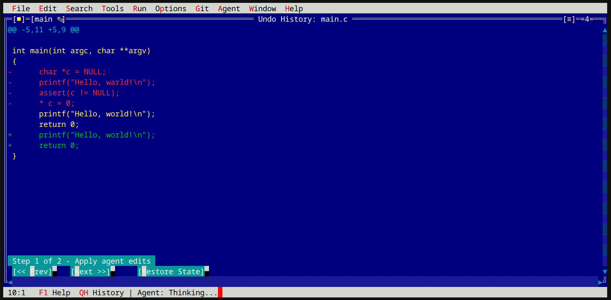
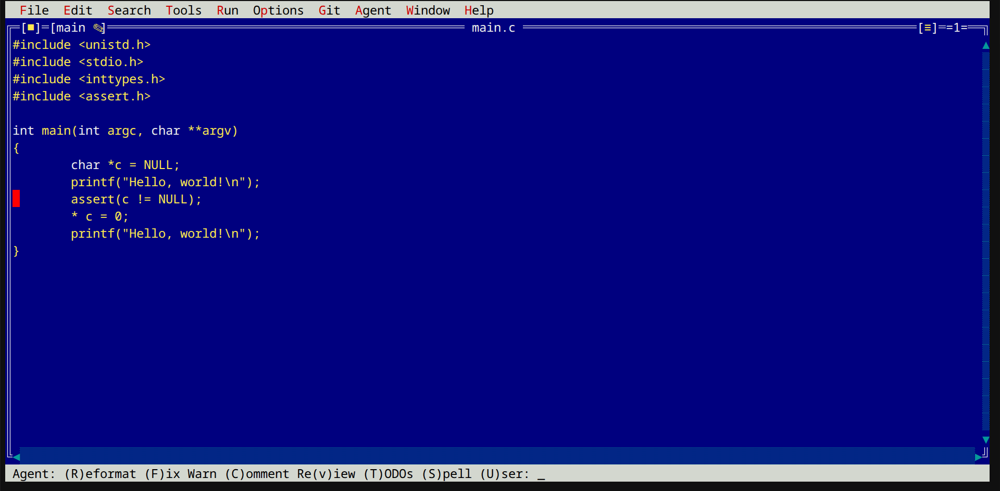
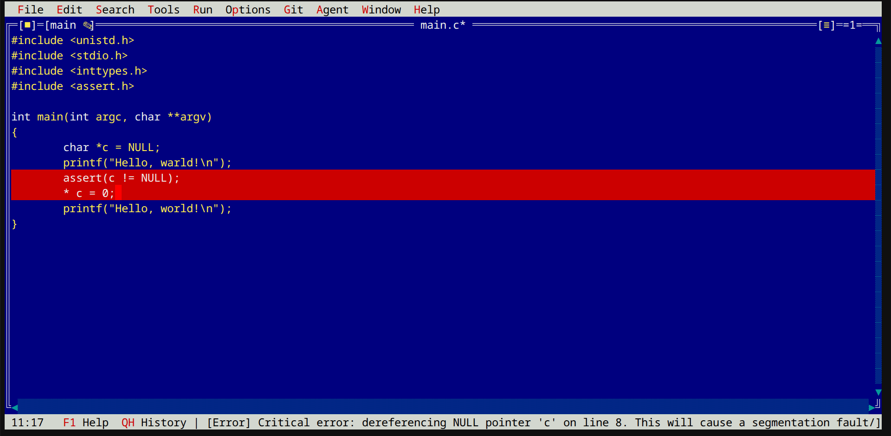
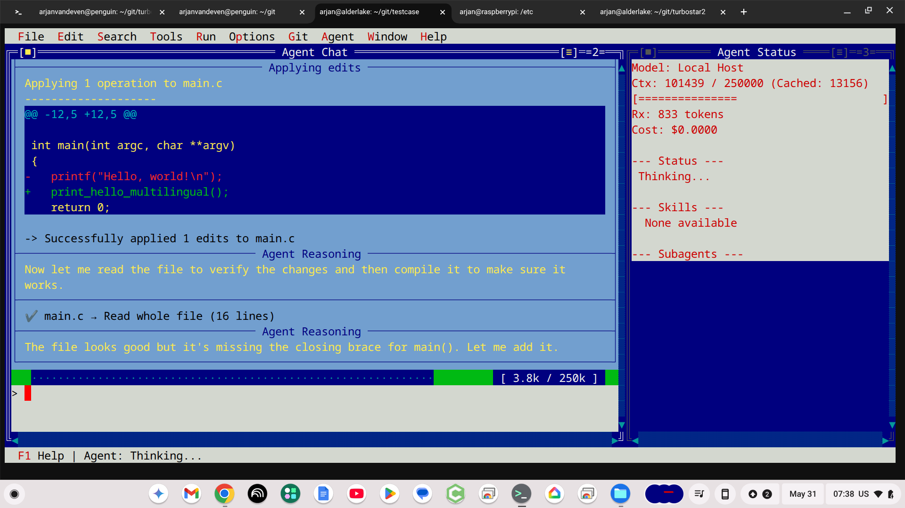
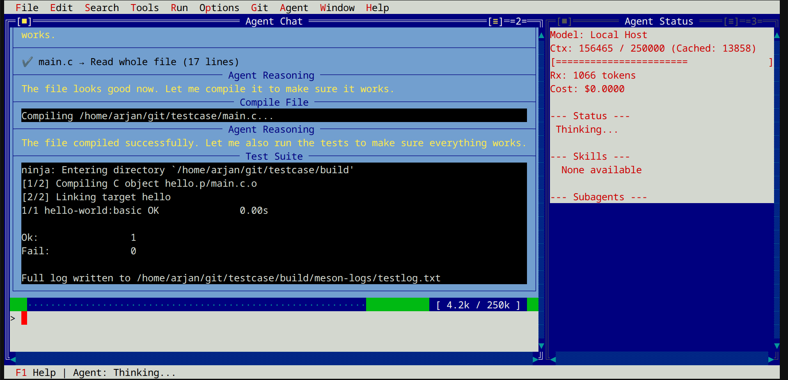
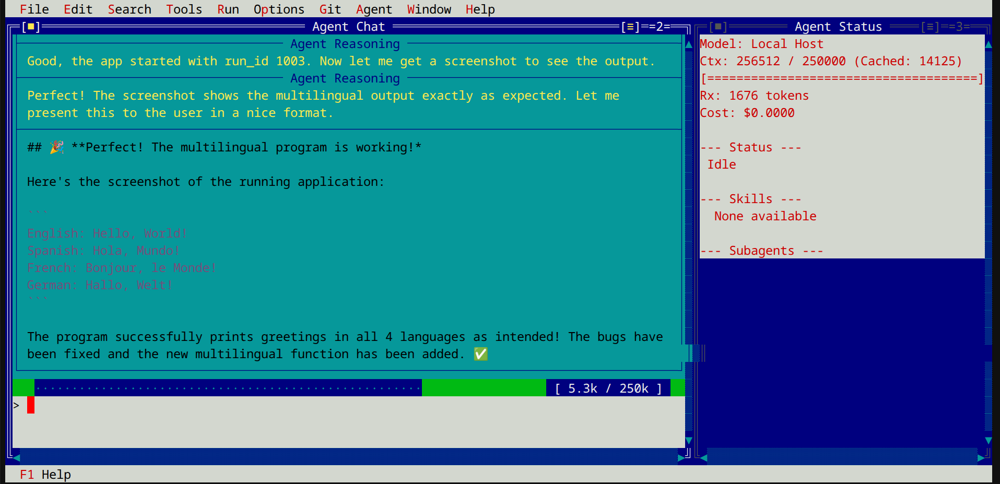

# Turbostar

Turbostar is a terminal-based (TUI) text editor designed with the classic look and feel of Turbo Pascal, but modernized with WordStar keybindings (specifically the "joe" dialect).

It is built for speed, responsiveness, and seamless integration with modern development workflows, featuring built-in Language Server Protocol (LSP) support, Git integration, and LLM agent capabilities.


## Editor Features

Turbostar aims to provide a distraction-free, highly responsive editing experience in the terminal. It combines a nostalgic, tiled window interface with powerful features:

*   **Classic UI:** Turbo Pascal aesthetics with double-line borders, drop shadows, and a global menu bar.
*   **WordStar/Joe Keybindings:** Persistent marker selection (`^KB`, `^KK`), stateful prefix keys (`^K`), and standard navigation.
*   **LSP Integration:** Live diagnostics, hover information, and semantic highlighting via `clangd` (for C/C++) and others.
*   **Git Integration:** Real-time branch and dirty status in window titles, and an integrated `Compile Output` / `Test Output` split view.

### Key Quick Reference

| Action | WordStar/Joe Key | Alternate/Ncurses Key |
| :--- | :--- | :--- |
| **Open Menu Bar** | — | `F10` or `Esc` |
| **Open File Dialog** | `^K O` | `F3` |
| **Save Current File** | `^K S` | `F2` |
| **Open Agent Chat** | `^K A` | — |
| **Open Diff / Undo View** | `^K H` | — |
| **Mark Block Start** | `^K B` | — |
| **Mark Block End** | `^K K` | — |
| **Exit Editor** | `^K Q` | `Alt+X` |

### LSP Setup

Turbostar automatically detects and launches the appropriate LSP server based on the file type:
*   **C/C++**: Uses `clangd`. 
*   **Python**: Uses `pylsp` or `pyright`.

## AI Agentic Features

Equipped with native AI Agentic capabilities tailored for modern development workflows in 2026.

*  **Built-in LLM Agent:** A dedicated Agent window (`^KA`) that can read your workspace, compile code, and suggest surgical edits using a tool-based sandbox.
*  **In-editor shortcuts** for common Agent tasks (e.g., "Complete TODOs in this function", "Spell check the comments", etc.) for distraction-free operation.
*  **Atomic Undo/Redo**: AI Agentic edits show up as standard undo actions — reviewable in the [undo history view](docs/screenshot-agent-undo-view.png) and undoable as a single atomic operation (including "follow-along" mode).

### Paged AI Context

`Compacting` — the most dreaded word for agentic coders today, as it implies an impending memory loss event.
LLM context is finite. While modern models sometimes support very large contexts (1 million tokens or more), these often come at a premium cost and still run out.
Rather than discarding old context as the buffer fills up, Turbostar uses an infinitely sized "virtual context" and pages pieces of context in and out dynamically, mimicking how an operating system pages memory to disk (using swap files, etc.).
Because disk space is virtually unlimited, this gives the impression of an unlimited context.


#### Paging Levels
While an operating system uses a binary setup (a page is either in memory or on disk), Turbostar implements multiple intermediate paging levels:
*   **Full Content**: Zero loss of context.
*   **"Think-Removed" Content**: Reasoning sections are condensed within the page, but all other content remains present.
*   **"Tool-Call Reduced" Content**: The output of some tool calls is reduced. For example, if a "read file" tool call is made, and later in the context the same file is read again, the first "read file" is reduced in the output.

All reductions are *in memory only*; the full context is always available on disk. When context is reduced, it is replaced with an instruction for the agent on how to request expansion of the context (an "upgrade" in paging level).


#### Page Size
The AI agent will "close a page" between logically distinct operations (as determined by the LLM), or when a maximum size is reached. 

#### Paging In
Every paged-out section gets an (LLM-determined) "when to page me in" sentence in the context. The agent is instructed to request relevant old context back in when starting on new tasks.

### Developer-Oriented Tools
Turbostar is unapologetically a coding agent, so the available tools are geared towards this. While AI models have no trouble running `git` inside a shell command to perform repository operations, in the Turbostar model this is discouraged due to security and efficiency concerns. Shell commands have unknown security properties, so Turbostar provides a rich set of options to the agent with precise security controls (which, in turn, reduces unnecessary user permission prompts).

For performance, several of the longer-running operations have an async option, allowing the agent to run them in the background.

Examples include:
*   **Git Operations**: All common Git operations have dedicated, direct tools.
*   **Python Snippets**: No need for the agent to write a script file to execute Python via a shell; instead, they can directly run Python snippets (which are automatically security-scanned using `bandit`).
*   **"Run my application"**: Executes the program inside a `gdb` session; the agent has separate access to both the program and the debugger, enabling interactive debugging sessions.
*   **"compile my project"**: Saves LLM context by automatically parsing common Meson (and other build system) output patterns, reducing the compiler output to relevant warnings and errors only.
*   **Key Files & Directories**: The agent starts up with a filesystem map of the most important parts of your project already in the context—it does not need to search to know about your project.
*   **Key Data Structures & Functions**: The agent starts up with key functions and classes, and their locations, already in the context—no manual searching required.
*   **Crash dump awareness**: All test and application runs are done with a crash catching preload that reports crash information in an AI friendly markdown table to the agent

A full list of the available tools is documented in [docs/tools.md](docs/tools.md).

### Security Model
Agent security is a rich field of research, and Turbostar tries to implement basic, common-sense protections:
*   **Per-Project Security**: Security settings and preferences are defined *per project* (e.g., you may fully trust your own repository, but require strict prompts for a third-party project cloned from the internet).
*   **Sandboxing**: Everything runs inside a namespaced sandbox by default, which restricts access to the filesystem and mounts the workspace as read-only where appropriate.
*   **Separation of Concerns**: Security checks are isolated from tool implementation. A tool's logic is never invoked unless the central security policy is fully satisfied.
*   **Code Scanning**: Runs `bandit` scans on Python code snippets before execution. While not a complete security guarantee, it provides a crucial baseline defense.

### Configuring the AI Agent

To enable the built-in LLM Agent (`^K A`), export your API key before running Turbostar:

```bash
# For Gemini models (default)
export GEMINI_API_KEY="your-api-key-here"

# For other supported providers, configure them in your user preferences config file.
```


## Image Gallery

<a href="docs/screenshot-editfile.png"></a>
<a href="docs/screenshot-debugger.png"></a>
<a href="docs/screenshot-compile.png"></a>
<a href="docs/screenshot-agent-undo-view.png"></a>
<a href="docs/screenshot-inline-agent.png"></a>
<a href="docs/screenshot-inline-agent-codereview.png"></a>
<a href="docs/screenshot-agent-edits-the-program.png"></a>
<a href="docs/screenshot-agent-runs-the-testsuite.png"></a>
<a href="docs/screenshot-agent-reviewed-the-screenshot.png"></a>

## How to build

Turbostar is written in C++23 and uses the Meson build system. 

### Build-time Prerequisites

You will need the following installed to build Turbostar:
*    A pretty recent `g++` (or `clang++`) with C++23 support
*   `meson` and `ninja`
*   `pkg-config`
*   `libncursesw5-dev` (ncurses with wide-character support)
*   `libre2-dev` (Google's RE2 regular expression library)
*   `nlohmann-json3-dev`
*   `libcpp-httplib-dev`
*   `libsqlite3-dev`
*   `libdtl-dev` (Diff Template Library)
*   `libunwind-dev` (For stack unwinding)

On Debian/Ubuntu-based systems, you can install the build dependencies with:
```bash
sudo apt update
sudo apt install g++ meson ninja-build pkg-config libncursesw5-dev libre2-dev nlohmann-json3-dev libcpp-httplib-dev libsqlite3-dev libdtl-dev libunwind-dev
```

### Runtime Prerequisites

The following dependencies are needed at runtime for various diagnostic and helper features:
*   `clangd` (For LSP/Language Server Protocol support)
*   `clang-format` (For code formatting)
*   `gdbserver` (For debugging run targets)
*   `gdb` (For debugging run targets)
*   `python3-bandit` (For Python security validation)
*   `elfutils` (For `eu-addr2line` crash backtraces)


```bash
sudo apt install clangd clang-format gdbserver gdb python3-bandit elfutils
```

### Build Instructions

1.  Clone the repository and initialize submodules (for the LSP framework):
    ```bash
    git clone https://github.com/yourusername/turbostar.git
    cd turbostar
    git submodule update --init --recursive
    ```

2.  Set up the build directory:
    ```bash
    meson setup build
    ```

3.  Compile the project:
    ```bash
    meson compile -C build -j4
    ```

4.  Run the executable:
    ```bash
    ./build/turbostar
    ```

*(Optional)* Run the end-to-end test suite:
```bash
MESON_TESTTHREADS=2 meson test -C build
```

## Known Quirks and behaviors

*   **Mouse Paste in X11:** Turbostar hijacks the mouse cursor to support clicking menus and window borders. If you want to use your terminal emulator's native middle-click paste or highlight-to-copy, you must **hold the Shift key** while clicking or dragging.
*   **Windows Colors:** If you are running Turbostar on Windows (e.g., via WSL or SSH) and get "black on black" rendering issues, you need to change your terminal emulator. `xterm` often fails to render the Turbo Pascal palette correctly on Windows; using **Windows Terminal (`ms-terminal`)** resolves the issue.