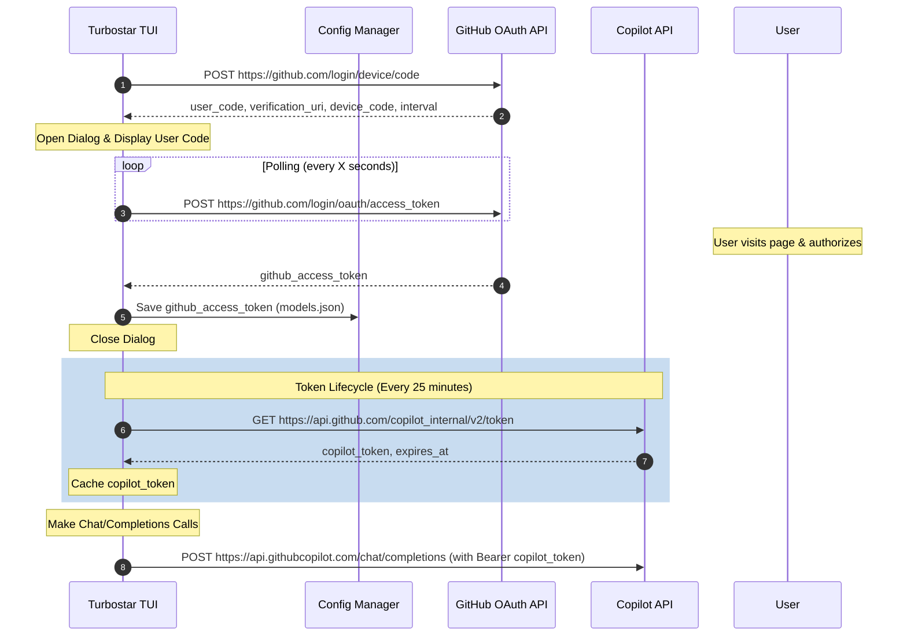

# GitHub Copilot OAuth Integration Plan

This document details the architectural design and step-by-step plan for implementing GitHub Copilot OAuth Device Flow authentication and token management within the Turbostar editor.

---

## 1. Architectural Overview

GitHub Copilot utilizes GitHub's OAuth 2.0 Device Authorization Grant (Device Flow). This is highly suited for terminal editors (like Turbostar) because it does not require spawning a local redirect HTTP web server on the user's host machine.



---

## 2. API Endpoints & Payloads

### Step A: Request Device Verification Code
* **Endpoint:** `POST https://github.com/login/device/code`
* **Headers:** 
  * `Accept: application/json`
* **Form Parameters:**
  * `client_id`: `Iv1.b507a08cbb0cc2c4` (Standard GitHub Copilot Client ID. This is required because GitHub restricts copilot-scoped tokens to official Client IDs.)
  * `scope`: `read:user`
* **Response Payload (JSON):**
  ```json
  {
    "device_code": "3584d835305513744c723226864861bff2d418e2",
    "user_code": "WDJB-MJHT",
    "verification_uri": "https://github.com/login/device",
    "expires_in": 900,
    "interval": 5
  }
  ```

### Step B: Poll for Access Token
* **Endpoint:** `POST https://github.com/login/oauth/access_token`
* **Headers:**
  * `Accept: application/json`
* **Form Parameters:**
  * `client_id`: `<client_id>`
  * `device_code`: `<device_code>`
  * `grant_type`: `urn:ietf:params:oauth:grant-type:device_code`
* **Response (Pending Authentication):**
  ```json
  {
    "error": "authorization_pending"
  }
  ```
* **Response (Successful Authentication):**
  ```json
  {
    "access_token": "gho_16C7ab42...",
    "token_type": "bearer",
    "scope": "read:user"
  }
  ```

### Step C: Retrieve Copilot Token
* **Endpoint:** `GET https://api.github.com/copilot_internal/v2/token`
* **Headers:**
  * `Authorization: token <access_token>`
  * `User-Agent: GithubCopilot/1.250.0`
* **Response Payload (JSON):**
  ```json
  {
    "token": "tid=3a9b5f...;exp=1781050409;...",
    "expires_at": 1781050409,
    "refresh_in": 1500
  }
  ```

---

## 3. Class Design & Code Changes

### A. Configuration Schema ([models.json](file:///home/arjan/git/turbostar2/src/agentlib/ai_model.cpp))
We will add fields to store the persistent GitHub Token and cache the short-lived Copilot token:
```json
{
  "id": "github-copilot",
  "name": "GitHub Copilot",
  "url": "https://api.githubcopilot.com",
  "type": "copilot",
  "github_access_token": "gho_...",
  "cached_copilot_token": "tid=...",
  "copilot_token_expires_at": 1781050409
}
```

### B. Copilot Authentication Manager
Create a dedicated manager `copilot_manager` inside `src/agentlib/` to handle token fetching and scheduling refreshes.

```cpp
// src/agentlib/copilot_manager.h
#pragma once
#include <string>
#include <mutex>
#include <chrono>

class copilot_manager {
public:
    static copilot_manager& get_instance();

    // Device Flow Trigger
    bool start_device_flow(std::string& user_code, std::string& verification_uri);
    bool poll_device_authorization(int interval_seconds);

    // Token retrieval
    std::string get_copilot_token();

private:
    copilot_manager() = default;
    
    std::string github_access_token_;
    std::string cached_copilot_token_;
    std::chrono::system_clock::time_point expires_at_;
    std::string device_code_;
    
    /* Mutex protecting shared cached token state */
    std::mutex token_mutex_;
};
```

### C. TUI Authentication Dialog ([dialog_factories.cpp](file:///home/arjan/git/turbostar2/src/ui/dialog_factories.cpp))
Implement a visual dialog factory method `show_copilot_auth_dialog` that:
1. Triggers `start_device_flow()`.
2. Spawns a background worker thread calling `poll_device_authorization()`.
3. Renders a popup box in the terminal displaying the 8-character verification code (`user_code`) and the login URL (`https://github.com/login/device`). The user can copy the URL or type it in their browser manually. No automatic browser opening is performed.
4. Cleans up and closes automatically on success or failure.

---

## 4. Implementation Status
All core infrastructure and TUI integration steps are completed:

- [x] **Step 1**: Defined `copilot` API type and configuration loading/saving fields.
- [x] **Step 2**: Implemented `copilot_manager` to support GitHub's OAuth Device Flow and short-lived Copilot token management.
- [x] **Step 3**: Updated `httplib_transport` with a token provider callback to authorize request headers without direct dependencies.
- [x] **Step 4**: Added the "Copilot connect..." TUI dialog and integrated it into the editor's options menu and main tick/idle polling loop.
- [x] **Step 5**: Configured client credentials using `GITHUB_CLIENT_ID` and `GITHUB_CLIENT_SECRET` environment variables, falling back to a default Client ID.
- [x] **Step 6**: Added query of GitHub models catalog (`https://models.github.ai/catalog/models`) at signup to write a formatted `models.json.github` into `~/.cache/turbostar/`.
- [x] **Step 7**: Added dynamic rate-limit (`slow_down`) detection, wall-clock throttling (minimum 2s), and a 1-second safety buffer to the polling interval.

