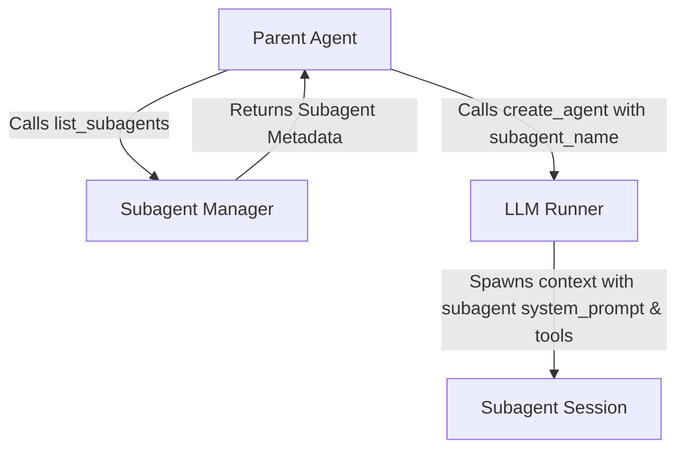

# Subagents Architecture & Design

This document details the architectural design for introducing a proper **Subagent Library** and **Subagent Manager** in Turbostar, allowing dynamic subagent definition via Markdown files with YAML frontmatter.

---

## 1. Built-in Subagents (Binary Embedding)

To ensure that core subagents (e.g., `research`, `self`) are always available without relying on external file structures, a set of built-in subagents will be compiled directly into the binary.

### Repository Structure
* A new top-level directory `agents/` is created at the repository root, containing default subagent definitions as Markdown files (e.g., `agents/research.md`, `agents/self.md`).

### Meson Compilation
* Meson will compile these markdown files into C++ headers containing raw character array strings, using the existing `scripts/embed_text.py` script.
* In [src/meson.build](file:///home/arjan/git/turbostar2/src/meson.build):
  ```meson
  research_agent_h = custom_target('research_agent.h',
    input : '../agents/research.md',
    output : 'research_agent.h',
    command : [embed_prog, join_paths(meson.project_source_root(), 'scripts/embed_text.py'), '@INPUT@', '@OUTPUT@', 'research_agent_md']
  )
  
  self_agent_h = custom_target('self_agent.h',
    input : '../agents/self.md',
    output : 'self_agent.h',
    command : [embed_prog, join_paths(meson.project_source_root(), 'scripts/embed_text.py'), '@INPUT@', '@OUTPUT@', 'self_agent_md']
  )
  ```
* These generated headers are added as dependency sources for `libagentlib`.

### Initialization
* During startup (inside `subagent_manager::initialize()`), the manager first loads and parses all built-in agent strings (e.g., `research_agent_md`, `self_agent_md`) using `YAML::Load` to populate the initial subagents list before scanning disk directories.

---

## 2. Directory Scanning Strategy

After loading the built-in subagents, the `subagent_manager` scans directories recursively to locate `*.md` files representing custom or overridden subagent definitions.

### Scanning Paths

| Type | Path | Purpose |
| --- | --- | --- |
| **Global** | `~/.agents/` | System-wide user subagent configurations |
| **Global** | `~/.cache/turbostar/agents/` | Cache directory for downloaded/synced subagents |
| **Global** | `~/.gemini/config/agents/` | Global agentic platform configurations |
| **Workspace** | `.agents/` | Project-scoped custom subagents (committed to repository) |

### Precedence & Overrides
If a custom subagent is scanned from a directory and shares the same `name` as a built-in agent (or an agent scanned earlier from a lower-priority path), the newer scanned agent **overrides** the previous definition. The order of loading and override precedence is:
1. **Built-in Agents** (Lowest priority)
2. **Global Paths** (`~/.cache/turbostar/agents/`, `~/.gemini/config/agents/`, `~/.agents/`)
3. **Workspace Path** (`.agents/`) (Highest priority)

---

## 3. Subagent Model & YAML Frontmatter Schema

Subagents are defined as Markdown files. The top of the file contains a YAML frontmatter block enclosed in `---` delimiters, and the rest of the file defines the **System Prompt** for the subagent.

### YAML Schema Mapping

To maintain maximum compatibility with both Claude Code subagent specs and standard C++ conventions, the manager will accept both `camelCase` and `snake_case` properties:

| YAML Key (camelCase / snake_case) | Type | Description |
| --- | --- | --- |
| `name` | String | **Required.** Unique identifier for the agent (lowercase, hyphens only). |
| `description` | String | **Required.** Behavioral description used by the routing LLM to delegate tasks. |
| `model` | String | *Optional.* Target model name (e.g. `gemini-1.5-pro`). Defaults to session model. |
| `tools` | Array of Strings | *Optional.* List of specific tool names that this agent is allowed to execute/see. |
| `toolFamilies` / `tool_families` | Array of Strings | *Optional.* List of active tool families allowed (maps to `tool_validator::get_family()`). |
| `readOnly` / `read_only` | Boolean | *Optional.* Regulates filesystem write access (determines `file_security_manager` permissions). |
| `permissionMode` / `permission_mode` | String | *Optional.* Configuration for safety prompts/approvals. |
| `effort` | String | *Optional.* Reasoning depth level (e.g., `high`, `default`). |
| `maxTurns` / `max_turns` | Integer | *Optional.* Bounds agent loop to prevent infinite execution chains. |

### C++ Class Representation

```cpp
#pragma once
#include <string>
#include <vector>
#include <optional>

namespace agentlib {

struct subagent {
    std::string name;
    std::string description;
    std::string system_prompt;               // Extracted from Markdown body
    std::optional<std::string> model;
    std::vector<std::string> tools;          // Explicit individual tool allow-list
    std::vector<std::string> tool_families;  // Active tool families (e.g. "base", "fs", "assembly")
    bool read_only{false};                   // If true, filesystem writes are disallowed
    std::optional<std::string> permission_mode;
    std::optional<std::string> effort;
    std::optional<int> max_turns;
    std::string file_path;                   // Location of definition file (empty for built-in)
};

} // namespace agentlib
```

---

## 4. Tool Visibility & Permission Enforcement

Subagent tool execution permissions are controlled by mapping subagent YAML properties directly to the underlying `agent_properties` structure associated with the spawned `ai_agent` session.

```text
YAML Schema              C++ agent_properties            Infrastructure Validation
┌──────────────┐         ┌────────────────────┐          ┌───────────────────────┐
│ tool_families├────────►│ active_families    ├─────────►│ tool_validator        │
│              │         │                    │          │  .is_allowed_for_agent│
├──────────────┤         ├────────────────────┤          ├───────────────────────┤
│ read_only    ├────────►│ read_only          ├─────────►│ file_security_manager │
│              │         │                    │          │  .validate_access     │
├──────────────┤         ├────────────────────┤          ├───────────────────────┤
│ tools        ├────────►│ active_tools       ├─────────►│ tool_registry         │
│              │         │ (new visibility vec)          │  (filter LLM schema)  │
└──────────────┘         └────────────────────┘          └───────────────────────┘
```

### 1. Tool Families Control
The list of `tool_families` (such as `"base"`, `"fs"`, `"security"`, or `"assembly"`) translates directly into the `std::vector<std::string> active_families` member of `agent_properties`.
* The validator checks `tool_validator::is_allowed_for_agent` against this list before allowing tool execution.
* If a plugin registers custom tools belonging to a new family, a subagent can access them by simply listing the family name in its frontmatter.

### 2. Filesystem Read-Only Protection
The `read_only` (or `readOnly`) boolean maps directly to `agent_properties::read_only`.
* When `read_only` is true, the `file_security_manager` resolves paths and validates operations with `access_type::read` maximum permission, blocking any write/modify operations at the filesystem layer.

### 3. Specific Tool Declarations
The `tools` array is mapped to a visibility filter (e.g., a new `active_tools` vector inside `agent_properties`).
* When the parent agent calls `create_agent` or when declaring schema capabilities to the LLM, the `tool_registry` dynamically filters out tool schemas that are not on the subagent's allowed `tools` list, keeping the LLM's system instructions and token footprint clean.

---

## 5. LLM Tool & Agent Creation Integration

Dynamically loaded subagents will integrate with the agent creation execution loop through new and updated tools.



### Updates to `create_agent`
* The `create_agent` tool parameters will receive an optional `subagent_name` string.
* When provided, the `llm_client` initializes the subagent session with the target subagent's `system_prompt`, `model` choice, and restricted tools array.

### New `list_subagents` Tool
* A new agent tool `list_subagents` will be registered.
* When called, it outputs a list of all active subagents loaded by the `subagent_manager` (returning their names and descriptions in a markdown table/JSON structure).
* This tool, alongside existing skill listings, will be dynamically declared to the parent agent to facilitate auto-discovery.

---

## 6. Dynamic Subagent Registration (Plugins)

Shared plugins can dynamically extend the subagent list by registering compiled-in subagent profiles.
* To register a subagent from a plugin, call `subagent_manager::get_instance().register_subagent(name, text)` inside the plugin's `plugin_run` lifecycle entry point.
* To unregister, call `subagent_manager::get_instance().unregister_subagent(name)` inside the plugin's `plugin_unload` lifecycle entry point.
* The `text` argument contains the raw markdown string with frontmatter, which is parsed and loaded into the subagents list with the origin path `plugin://<name>`.

---

## 7. Deferments (Post-MVP Checklist)

* **Hot Reloading / `/rescan`**: Provide a TUI slash command or shortcut to re-trigger directory scanning without restarting the editor.
