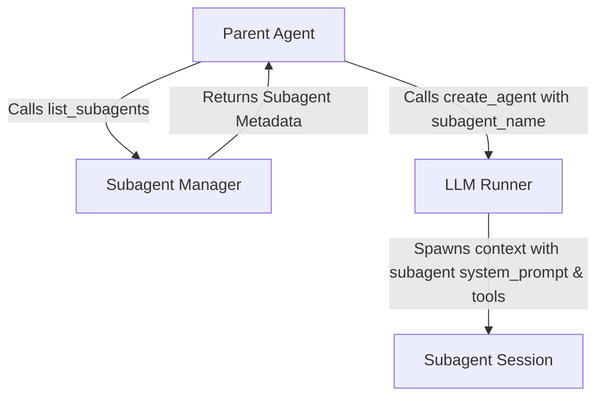

# Subagents Architecture & Design

This document details the architectural design for introducing a proper **Subagent Library** and **Subagent Manager** in Turbostar, allowing dynamic subagent definition via Markdown files with YAML frontmatter.

---

## 1. Directory Scanning Strategy

At startup, the `subagent_manager` will scan directories recursively to locate `*.md` files representing subagent definitions.

### Scanning Paths

| Type | Path | Purpose |
| --- | --- | --- |
| **Global** | `~/.agents/` | System-wide user subagent configurations |
| **Global** | `~/.cache/turbostar/agents/` | Cache directory for downloaded/synced subagents |
| **Global** | `~/.gemini/config/agents/` | Global agentic platform configurations |
| **Workspace** | `.agents/` | Project-scoped custom subagents (committed to repository) |

---

## 2. Subagent Model & YAML Frontmatter Schema

Subagents are defined as Markdown files. The top of the file contains a YAML frontmatter block enclosed in `---` delimiters, and the rest of the file defines the **System Prompt** for the subagent.

### YAML Schema Mapping

To maintain maximum compatibility with both Claude Code subagent specs and standard C++ conventions, the manager will accept both `camelCase` and `snake_case` properties:

| YAML Key (camelCase / snake_case) | Type | Description |
| --- | --- | --- |
| `name` | String | **Required.** Unique identifier for the agent (lowercase, hyphens only). |
| `description` | String | **Required.** Behavioral description used by the routing LLM to delegate tasks. |
| `model` | String | *Optional.* Target model name (e.g. `gemini-1.5-pro`). Defaults to session model. |
| `tools` | Array of Strings | *Optional.* List of specific tools the agent can see/call. |
| `toolFamilies` / `tool_families` | Array of Strings | *Optional.* Custom groupings of tool permissions (e.g. `:read`, `:write`). |
| `readOnly` / `read_only` | Boolean | *Optional.* Restricts the agent from using modifying/destructive tool families. |
| `permissionMode` / `permission_mode` | String | *Optional.* Configuration for safety prompts/approvals. |
| `effort` | String | *Optional.* Reasoning depth level (e.g., `high`, `default`). |
| `maxTurns` / `max_turns` | Integer | *Optional.* Bounds agent loop to prevent infinite execution chains. |

### C++ Class Representation

```cpp
#pragma once
#include <string>
#include <vector>
#include <optional>

namespace agentlib {

struct subagent {
    std::string name;
    std::string description;
    std::string system_prompt;               // Extracted from Markdown body
    std::optional<std::string> model;
    std::vector<std::string> tools;
    std::vector<std::string> tool_families;  // Custom groupings (e.g. ":read")
    bool read_only{false};                   // Restricts modifying operations
    std::optional<std::string> permission_mode;
    std::optional<std::string> effort;
    std::optional<int> max_turns;
    std::string file_path;                   // Location of definition file
};

} // namespace agentlib
```

---

## 3. Tool Visibility & Permission Enforcement

Rather than active sandboxing, the subagent configurations define the **visibility** and **allow-listing** of tools inside the subagent's runtime context.

### Filtering Rules

1. **Tool Families Filtering**:
   If `tool_families` is defined, only tools belonging to those families are registered for the subagent.
2. **Specific Tools Listing**:
   If `tools` is defined, only those tools are added.
3. **`read_only` Constraint**:
   If `read_only` is true, the subagent's tool context automatically excludes any tool matching the `:write` or `:execute` families, regardless of other settings.

---

## 4. LLM Tool & Agent Creation Integration

Dynamically loaded subagents will integrate with the agent creation execution loop through new and updated tools.



### Updates to `create_agent`
* The `create_agent` tool parameters will receive an optional `subagent_name` string.
* When provided, the `llm_client` initializes the subagent session with the target subagent's `system_prompt`, `model` choice, and restricted tools array.

### New `list_subagents` Tool
* A new agent tool `list_subagents` will be registered.
* When called, it outputs a list of all active subagents loaded by the `subagent_manager` (returning their names and descriptions in a markdown table/JSON structure).
* This tool, alongside existing skill listings, will be dynamically declared to the parent agent to facilitate auto-discovery.

---

## 5. Deferments (Post-MVP Checklist)

* **Hot Reloading / `/rescan`**: Provide a TUI slash command or shortcut to re-trigger directory scanning without restarting the editor.
