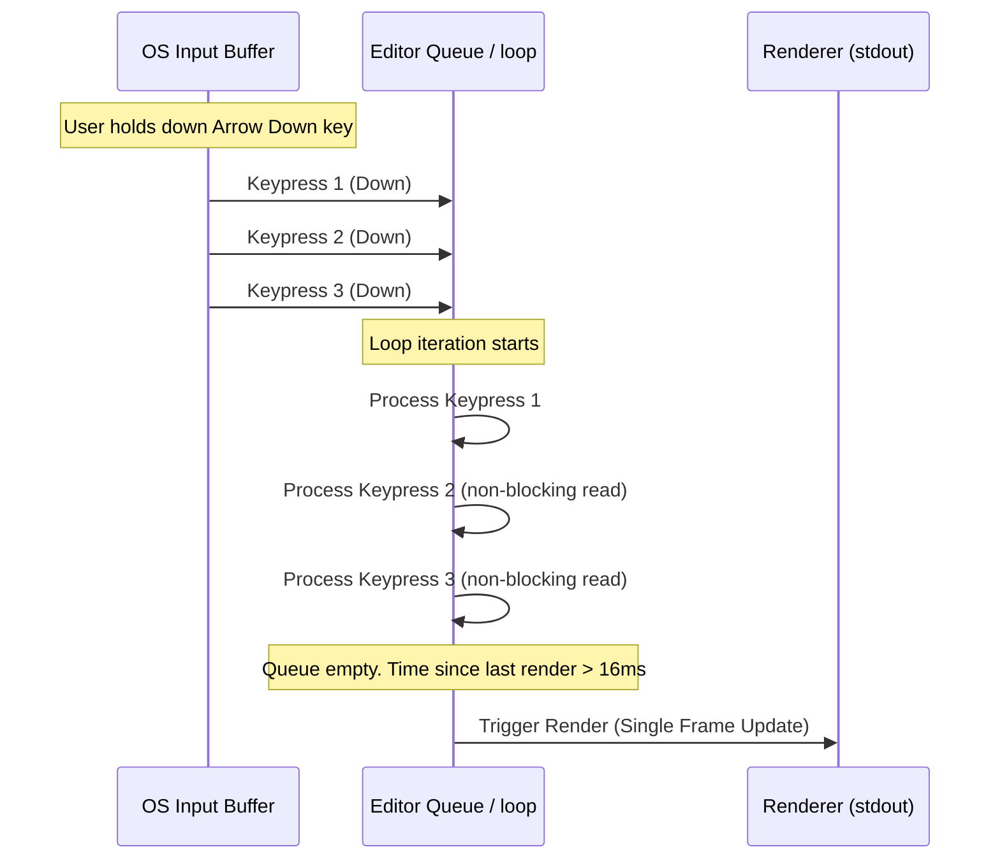

# Proposal: Input Coalescing and Refresh Throttling

## 1. Background & Problem Statement
Currently, the editor's main loop reads keyboard and mouse events using `get_wch()`. If a key event is processed, the editor immediately repaints the screen. 

Under normal typing speeds, this behaves fine. However, under the following scenarios:
1. **High Keyboard Repeat Rates**: When a navigation key (like arrow keys or PageUp/PageDown) is held down, the OS triggers repeating keypresses at a high rate.
2. **Text Pasting**: When a user pastes text, the terminal emulator stream is read as a high-frequency sequence of separate characters.
3. **Macro Execution**: Running rapid sequences of automated commands.

Redrawing the terminal screen (writing ANSI escape sequences to `stdout`) on every single key event is highly expensive and can saturate the terminal's write buffers. This results in **input lag** (where the screen lags behind typing), cursor stuttering, and high CPU usage.

---

## 2. Proposed Solution
Implement **Input Coalescing and Refresh Throttling** in the main editor loop. Instead of rendering immediately for every keypress:
1. We process all immediately pending keypresses in the input queue in a single loop iteration.
2. We throttle screen refreshes under heavy input load so that we render at most once per frame window (e.g., ~16ms for 60Hz or ~33ms for 30Hz), ensuring smooth visual feedback.
3. If the input queue becomes completely empty and a frame window has not yet passed, we still render immediately to ensure zero perceived input latency for single keypresses.

### Sequence diagram of event throttling:


---

## 3. Pro / Con Analysis

### Pros
* **Latency Reduction**: Dramatically lowers CPU and terminal I/O load during continuous navigation, scrolling, or scrolling-intensive operations.
* **Lag Elimination**: Prevents keystrokes from queueing up and lagging behind the user's cursor.
* **Pasting Performance**: Pasted text block renders in a single paint operation instead of dozens or hundreds.
* **Battery & Power Efficiency**: Fewer unnecessary frame paints save host resources.

### Cons & Technical Challenges
* **Escape Sequence Fragmentation**: Escape sequences (e.g. arrow keys sending `\x1b[A`) arrive in chunks. Doing a raw file descriptor `poll` on stdin could return true for a partial escape sequence.
  * *Mitigation*: Check for pending events using ncurses' input queue (`timeout(0)` + `get_wch()`) rather than raw file descriptor polling. ncurses handles multi-byte assembly.
* **Render Starvation**: If input is continuously arriving without pause, rendering could theoretically be delayed indefinitely.
  * *Mitigation*: Enforce a hard frame timeout (e.g., render at least once every 16ms/33ms even if more input is pending).
* **Perceived Lag**: If the frame budget is too high, the editor will feel sluggish.
  * *Mitigation*: Use a tight 16ms window (60Hz limit) or render immediately when the queue goes empty.

---

## 4. Proposed Main Loop implementation

```cpp
auto last_render_time = std::chrono::steady_clock::now();

while (is_running_) {
    wint_t wch;
    // Set timeout to 50ms (or current default) to wait for next event when idle
    timeout(50);
    int res = get_wch(&wch);

    if (res != ERR) {
        // 1. Process the initial key event
        process_key_event(res, wch);

        // 2. Coalesce: Drain any other immediately available key events
        timeout(0); // Set non-blocking mode
        wint_t next_wch;
        int next_res;
        while ((next_res = get_wch(&next_wch)) != ERR) {
            process_key_event(next_res, next_wch);
        }
        timeout(50); // Restore timed-blocking mode

        // 3. Render decision
        auto now = std::chrono::steady_clock::now();
        auto elapsed_ms = std::chrono::duration_cast<std::chrono::milliseconds>(now - last_render_time).count();

        // If at least 16ms passed OR the queue is completely drained, we paint
        if (elapsed_ms >= 16) {
            render();
            last_render_time = now;
        } else {
            // Delay rendering; the next iteration (or idle timer) will paint
            needs_redraw_ = true;
        }
    } else {
        // Idle/no input: process background events (e.g., LSP, timers)
        if (needs_redraw_) {
            render();
            last_render_time = std::chrono::steady_clock::now();
            needs_redraw_ = false;
        }
    }
}
```
