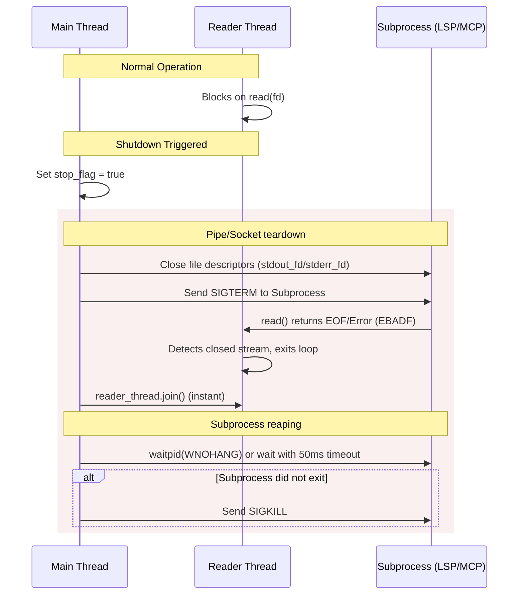

# Turbostar Thread Lifecycle & Fast Exit Architecture Blueprint

This document defines the architectural blueprint, design patterns, and coding standards for thread management and subprocess teardown in Turbostar. Adherence to these guidelines is critical to maintaining a highly responsive user interface and achieving near-instantaneous exit times (under 50ms).

---

## 1. Thread Inventory in Turbostar

The Turbostar editor leverages a multi-threaded architecture to decouple heavy I/O, subprocess communication, and LLM reasoning from the primary user interface thread.

| Thread Name | Owner Class | Lifetime | Teardown Mechanism |
| :--- | :--- | :--- | :--- |
| **Main / UI Thread** | `editor` / `main()` | App start to App exit | Direct return from `main()` |
| **Git Status Worker** | `git_manager` | App start to Editor exit | Mutex + `std::condition_variable` + flag |
| **LLM Background Summarizer** | `ai_agent` | Agent session | Cancellation of `httplib_transport` + exit flag |
| **LSP Connection Message Reader** | `lsp_manager` | LSP Server runtime | Stream shutdown + exit flag + thread join |
| **MCP Startup Coordinator** | `mcp_manager` | Startup phase | Short-lived thread join |
| **MCP Tool Generation Worker** | `mcp_manager` | App runtime | Mutex + `std::condition_variable` + exiting flag |
| **MCP Subprocess Reader (STDOUT/STDERR)** | `mcp_server` | Subprocess runtime | Process kill (`SIGKILL`) + pipe close + join |
| **Process Run PTY Reader** | `process_runner` | Subprocess runtime | Process kill (`SIGKILL`) + pipe close + join |
| **Asynchronous Tool Execution** | Various tool entries | One-off execution | Detached threads |

---

## 2. Core Thread Design Patterns

To prevent exit delays and hangs, all threads in Turbostar must implement one of the following termination patterns.

### Pattern A: Mutex / Condition Variable Queue Worker

For background workers that poll or wait for jobs from an internal queue (e.g., `git_manager`, `ai_agent` background summary thread).

> [!IMPORTANT]
> **Key Rule**: The worker thread must check the shutdown flag *both* inside the condition variable predicate and immediately after waking up.

#### Implementation Template
```cpp
// 1. Teardown trigger (invoked from Main Thread)
void stop_worker() {
	is_exiting_ = true;
	cv_.notify_all(); // Wake up the thread immediately
	if (worker_thread_.joinable()) {
		worker_thread_.join(); // Blocks briefly until thread finishes current pass
	}
}

// 2. Loop structure (running on Worker Thread)
void worker_loop() {
	while (!is_exiting_) {
		Job job;
		{
			std::unique_lock<std::mutex> lock(mutex_);
			cv_.wait(lock, [this] { return !queue_.empty() || is_exiting_; });

			if (is_exiting_) {
				break;
			}
			job = queue_.front();
			queue_.pop();
		}
		process(job);
	}
}
```

---

### Pattern B: Subprocess I/O Reader Thread

For threads that run in a loop blocking on synchronous I/O read operations (e.g., pipes or sockets connected to a subprocess like LSP or MCP).



> [!CAUTION]
> **The Anti-Pattern**: Setting `is_running_ = false` and calling `join()` *without* closing the file descriptors or killing the process. Since the read operation blocks indefinitely, the thread will never see the flag, causing a hang.

#### Implementation Template
```cpp
// 1. Teardown trigger (invoked from Main Thread)
void stop_reader() {
	is_running_ = false;

	// Close standard handles first to unblock read() in the thread
	if (stdout_fd_ >= 0) {
		close(stdout_fd_);
		stdout_fd_ = -1;
	}

	// Kill the child process (or send SIGTERM)
	if (pid_ > 0) {
		kill(pid_, SIGTERM);
	}

	// Join is now instant because read() returned immediately due to EBADF/EOF
	if (reader_thread_.joinable()) {
		reader_thread_.join();
	}
}
```

---

### Pattern C: Asynchronous / Detached Threads

Used only for dynamic, one-off background operations spawned by agent tools (e.g. running a long compiler command in the background). 

> [!WARNING]
> Detached threads must use a `std::weak_ptr` when referencing parent context structures (such as `ai_agent`). Referencing `shared_from_this()` directly will extend the lifetime of the parent, preventing it from being destructed and stopping its threads on shutdown!

#### Implementation Template
```cpp
std::weak_ptr<ai_agent> weak_agent = shared_from_this();

std::thread([weak_agent]() {
	// Perform heavy task
	run_compiler();

	// Check if parent still exists before updating status
	if (auto agent = weak_agent.lock()) {
		agent->inject_context("system", "Build completed.");
	}
}).detach();
```

---

## 3. Subprocess Teardown & Fast Exit Protocol

When exiting the editor, child processes (LSP language servers, MCP servers, running debuggers) can delay the shutdown sequence. To avoid blocking:

1. **Close Pipes First**: Always close the parent ends of the communication pipes first. This signals EOF to the child and unblocks the local reader thread.
2. **Terminate Asynchronously / With Timeout**:
   - Send `SIGTERM` to allow the child to perform cleanup.
   - Run a non-blocking poll loop (`waitpid(pid, &status, WNOHANG)`) with a maximum total timeout of **50ms**.
   - If the process is still running after 50ms, issue `SIGKILL` to force exit and immediately reap using `waitpid(pid, &status, 0)`.
3. **Avoid Indefinite Blocks**: Never call blocking wait operations (`waitpid(pid, nullptr, 0)` or `Process::wait()`) directly on the main thread if the child process might ignore `SIGTERM` or take a long time to shutdown.

---

## 4. Case Study: LSP Manager Exit Latency

In `lsp_manager::lsp_stop()`, the main thread blocks during exit:
```cpp
// Delay source
if (server->process) {
    server->process->terminate(); // Synchronously calls waitpid(..., 0)
}
```
If the LSP process (e.g. `clangd` or `gopls`) is cleaning up cache, it blocks the main thread for 500ms+. 

**The Fix**:
* Signal the process, close pipes, and join the reader thread.
* Let the process reap asynchronously or kill it with `SIGKILL` if it exceeds the 50ms timeout threshold, preventing any visible exit lag for the user.
